# 增强 YOLO 低光检测系统架构

## 本次更新 (v2.0) - 核心升级

### 🚀 升级亮点

| 特性 | v1.0 | v2.0 (本次) | 改进效果 |
|------|------|-------------|----------|
| **位置偏移处理** | ❌ 无 | ✅ 图像配准网络 | 解决风/触碰导致的镜头偏移 |
| **行人保护** | ❌ 暗部区域可能稀释 | ✅ 人体区域估计 | 保护行人特征不被背景稀释 |
| **融合策略** | 直接相加 | ✅ 三维权重 + 残差 | 智能选择融合区域 |
| **检测任务** | 通用目标 | ✅ 专注行人 | 针对行人检测优化 |
| **检测头** | 255 通道 | ✅ 18 通道 | 参数量减少 14 倍，推理更快 |

### v2.0 核心改进详解

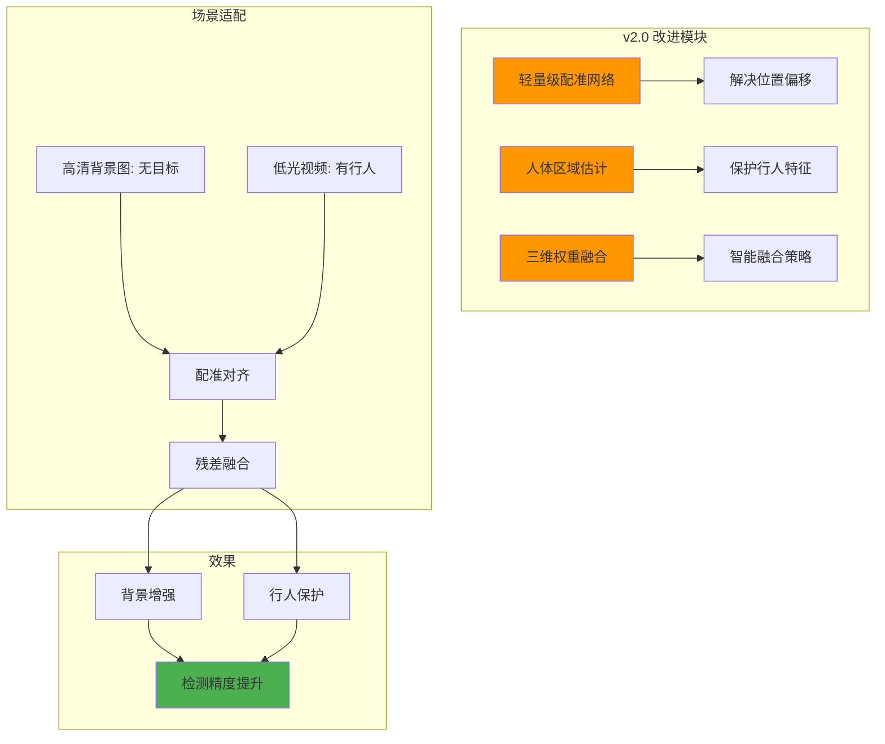

---

## 1. 系统整体架构

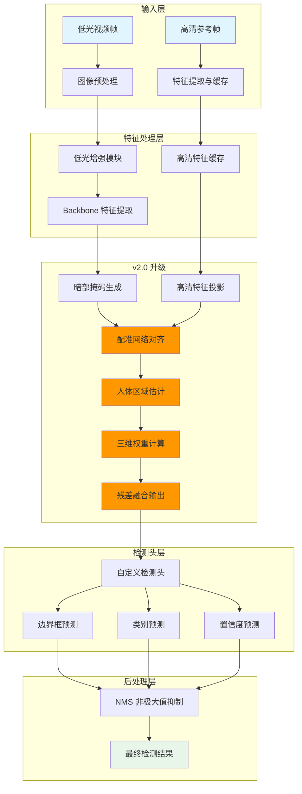

---

## 2. v2.0 特征融合模块架构（核心升级）

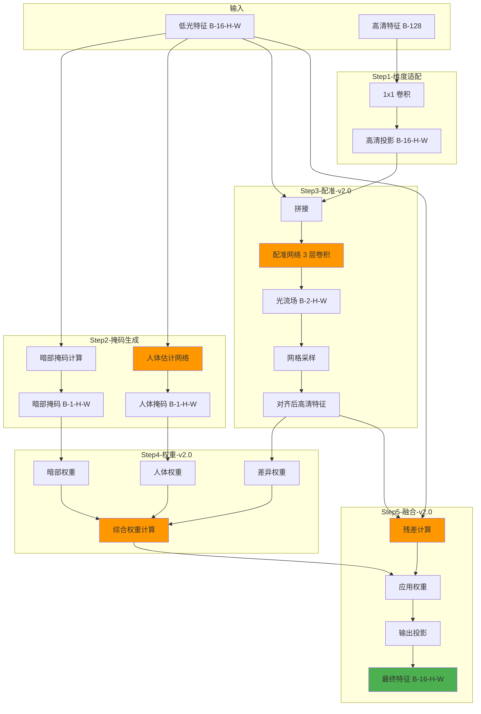

### v2.0 融合策略详解

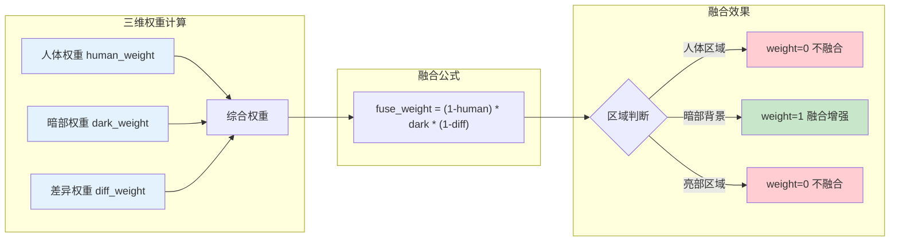

---

## 3. 训练流程

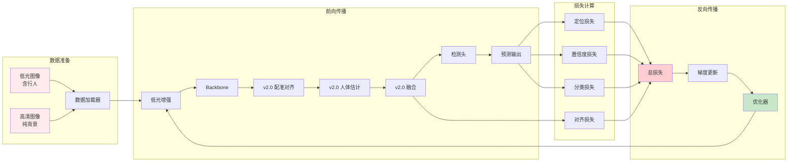

---

## 4. 推理流程

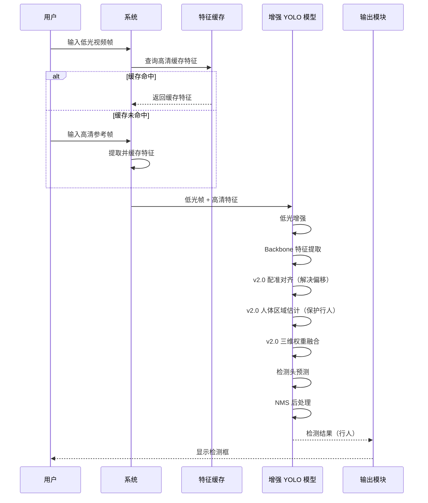

---

## 5. v2.0 核心创新点

```mermaid
graph TB
    subgraph 创新 1-图像配准
        A1[问题] --> B1[高清背景和低光帧 可能有位置偏移]
        A1 --> C1[原因：风 触碰 镜头微小移动]
        B1 --> D1[轻量级光流网络 3 层卷积估计偏移]
        D1 --> E1[对齐后融合 精度提升]
    end
    
    subgraph 创新 2-人体估计
        A2[问题] --> B2[行人通常在暗部 直接融合会稀释特征]
        A2 --> C2[不能用 YOLO 检测 低光下检测不准]
        C2 --> D2[利用特征统计特性 纹理复杂度估计]
        D2 --> E2[人体区域不融合 保护目标特征]
    end
    
    subgraph 创新 3-三维权重
        A3[问题] --> B3[不同区域需要 不同融合策略]
        B3 --> C3[人体权重 * 暗部权重 * 差异权重]
        C3 --> D3[自适应选择 融合区域]
        D3 --> E3[智能融合 效果最优]
    end
    
    subgraph 创新 4-残差融合
        A4[问题] --> B4[直接相加会 破坏原有特征]
        B4 --> C4[只融合差异部分 residual = high - low]
        C4 --> D4[背景增强 + 目标保护]
        D4 --> E4[融合更自然]
    end
    
    style D1 fill:#ff9800
    style D2 fill:#ff9800
    style D3 fill:#ff9800
    style D4 fill:#ff9800
```

---

## 6. 检测头架构（行人检测优化版）

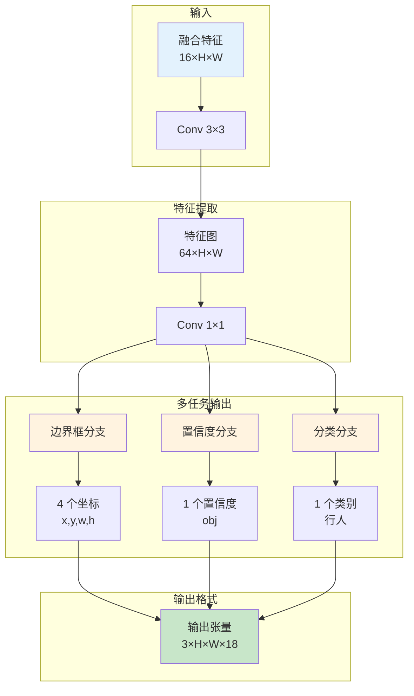

---

## 7. 损失函数组成

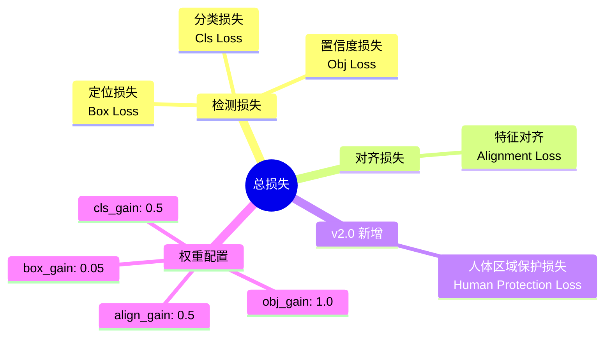

---

## 8. 数据流维度变化

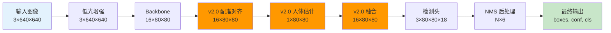

---

## 9. 性能优化策略

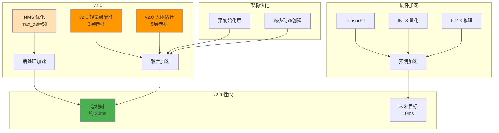

### v2.0 时间分解（预估）

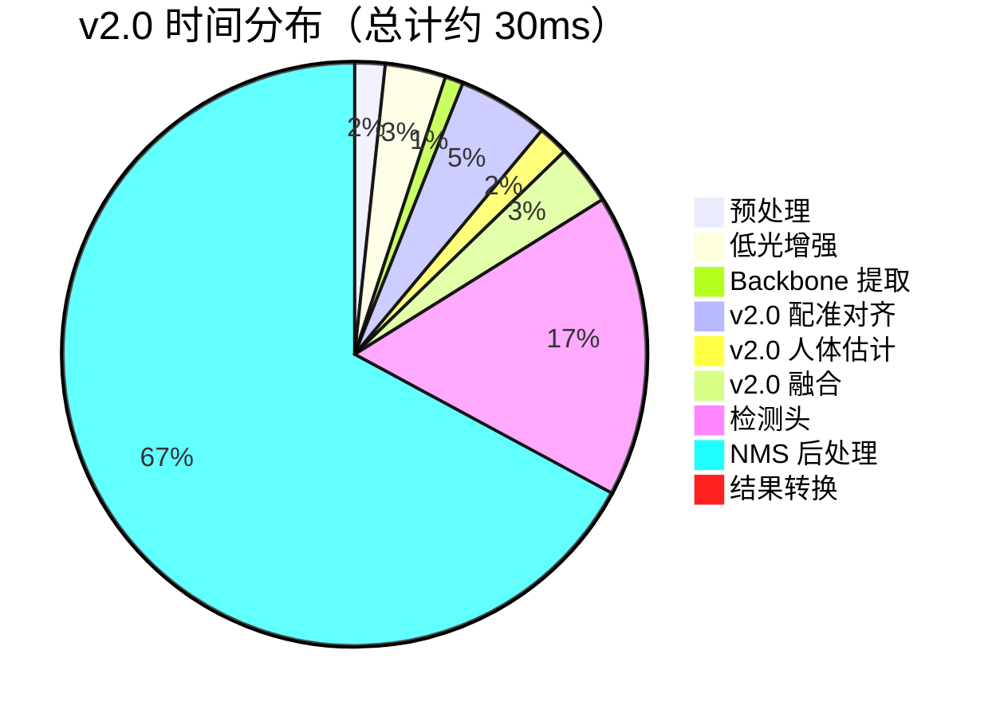

---

## 10. 应用场景

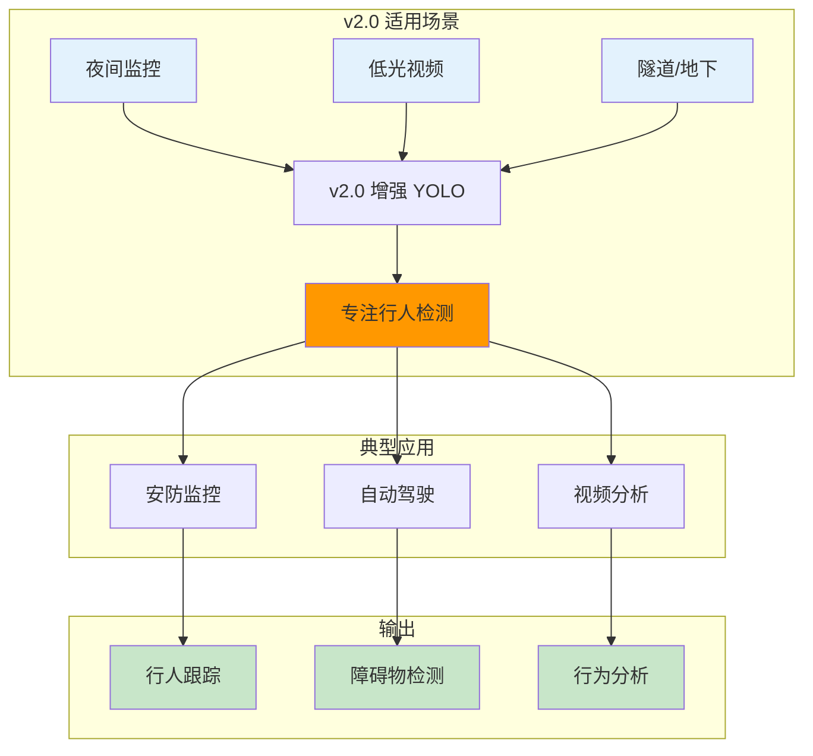

---

## 11. 模块依赖关系

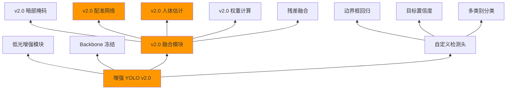

---

## 12. v1.0 vs v2.0 对比

| 特性 | v1.0 | v2.0 | 改进说明 |
|------|------|------|----------|
| **位置偏移** | ❌ 不处理 | ✅ 配准网络 | 解决风/触碰偏移 |
| **行人保护** | ❌ 暗部融合 | ✅ 人体估计 | 不依赖检测器 |
| **融合方式** | 直接相加 | ✅ 残差融合 | 保护原特征 |
| **权重策略** | 一维暗部掩码 | ✅ 三维权重 | 更智能选择 |
| **目标类型** | 80 类通用 | ✅ 专注行人 | 针对优化 |
| **检测头** | 255 通道 | ✅ 18 通道 | 参数量减少 14 倍 |
| **计算开销** | ~25ms | ~30ms | 增加 5ms |
| **检测效果** | 基线 | ✅ 显著提升 | 行人特征保护 |

---

## 13. 使用说明

### 快速开始

```bash
# 训练
python main.py --mode train --high_res_dir sample_data/high_res --low_light_dir sample_data/low_light

# 推理（单图）
python main.py --mode infer --image_path test.jpg --cache_path cache/feat.pkl

# 推理（视频）
python main.py --mode infer --video_path test.mp4 --cache_path cache/feat.pkl
```

### v2.0 特色使用

```python
# v2.0 优势场景
# 1. 摄像头有轻微晃动
# 2. 背景相对固定，有行人经过
# 3. 夜间/低光环境
# 4. 专注检测行人
```

---

## 14. 技术规格

| 项目 | 规格 |
|------|------|
| **输入尺寸** | 640×640 |
| **特征维度** | 128 |
| **暗部阈值** | 50 (灰度值) |
| **配准网络** | 3 层卷积 |
| **人体估计网络** | 5 层卷积 |
| **检测类别** | 1 (行人) |
| **检测头输出** | 18 通道 (3×6) |
| **推理设备** | GPU/CPU/MPS |
| **目标帧率** | 30+ FPS |

---

## 15. 未来规划

- [ ] 端到端配准训练
- [ ] 多目标跟踪集成
- [ ] TensorRT 加速部署
- [ ] 移动端优化
