# 增强 YOLO 低光检测系统架构

## 1. 系统整体架构

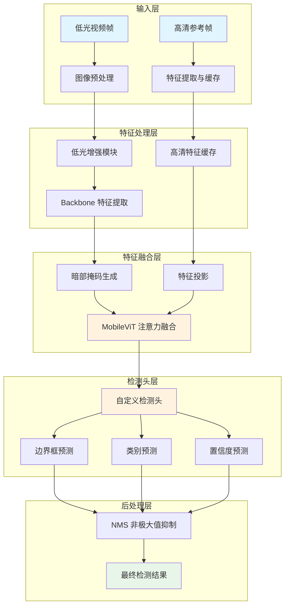

## 2. 训练流程

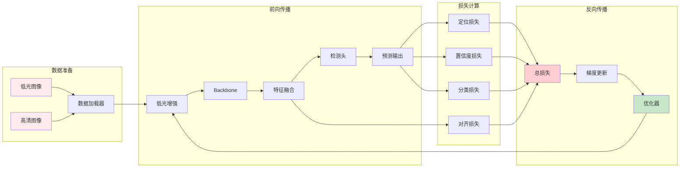

## 3. 推理流程

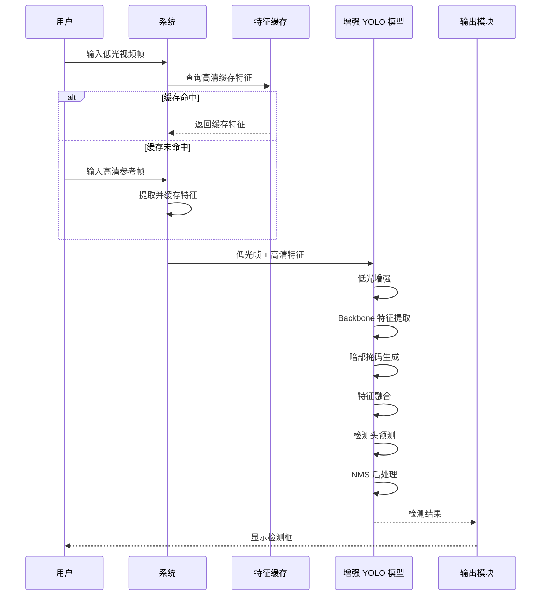

## 4. 特征融合模块详细架构

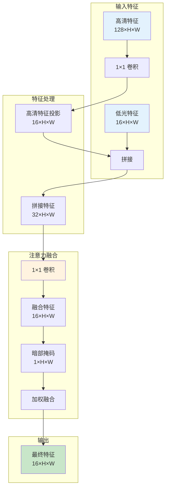

## 5. 检测头架构

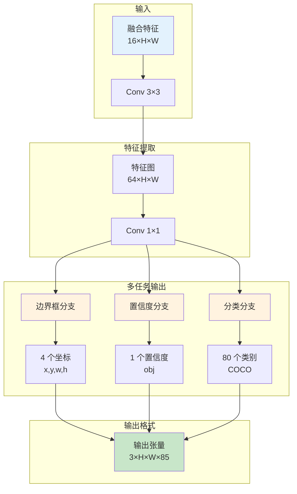

## 6. 损失函数组成

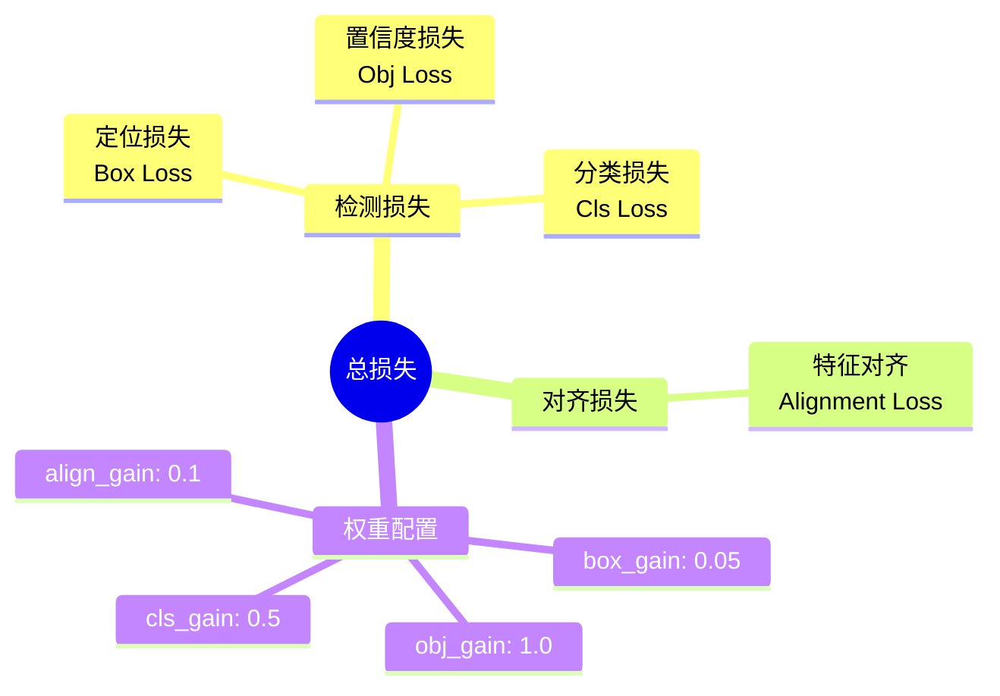

## 7. 数据流维度变化

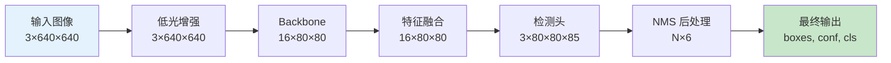

## 8. 性能优化策略

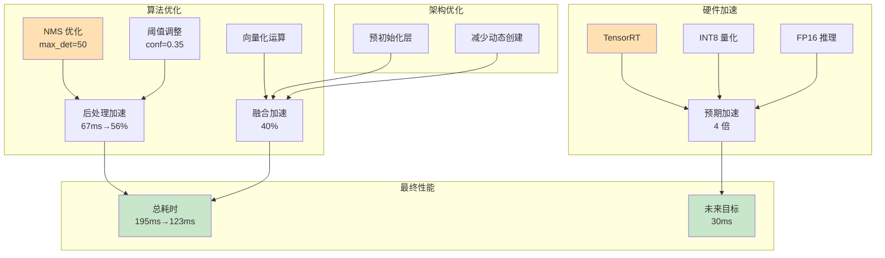

## 9. 模块依赖关系

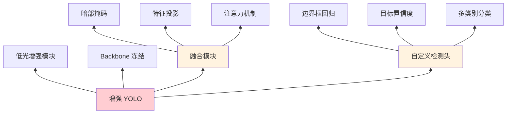

## 10. 应用场景

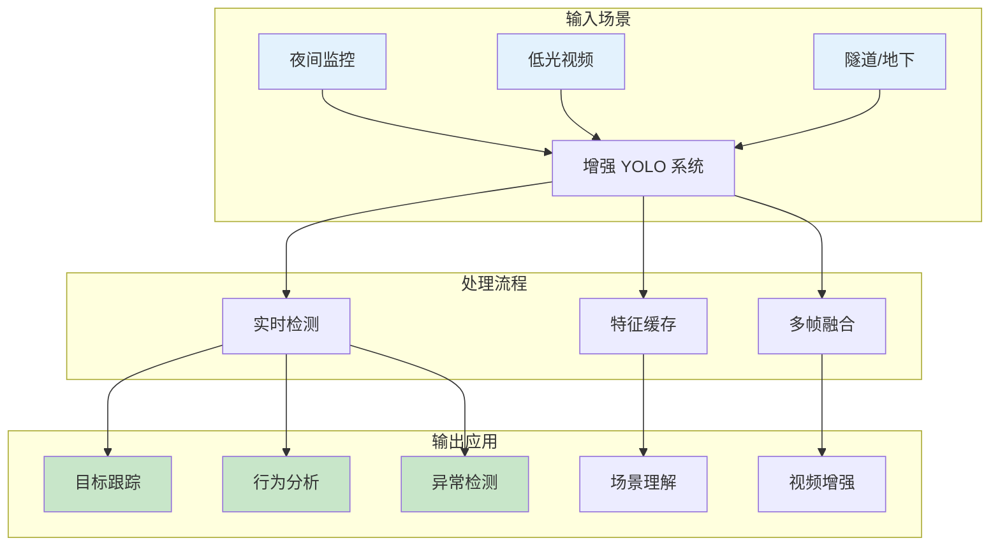

## 11. 时间分解（性能分析）

### 甘特图

```mermaid
gantt
    title 增强 YOLO 推理时间分解（总耗时：123ms）
    dateFormat  X
    axisFormat %Lms
    section 预处理
    图像转张量       :0, 1
    section 前向传播
    低光增强         :1, 1
    Backbone 提取    :2, 1
    暗部掩码生成     :3, 8
    特征融合         :11, 11
    检测头           :22, 8
    section 后处理
    NMS 等           :30, 67
    section 结果转换
    格式转换         :97, 3
```

### 时间分布饼图

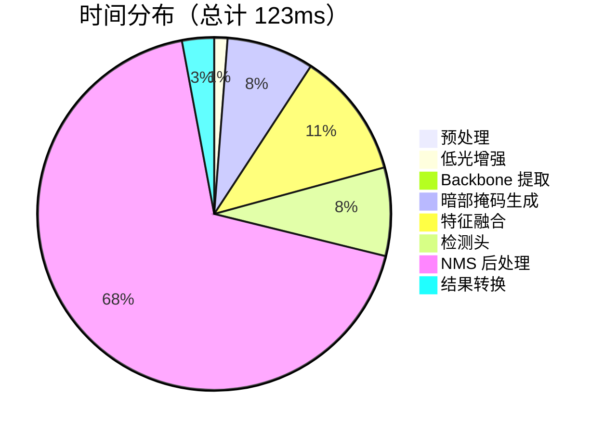

### 横向柱状图

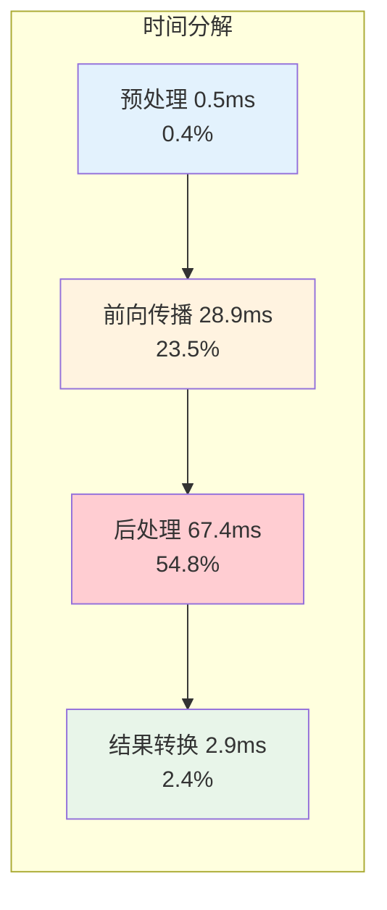

## 12. 关键创新点

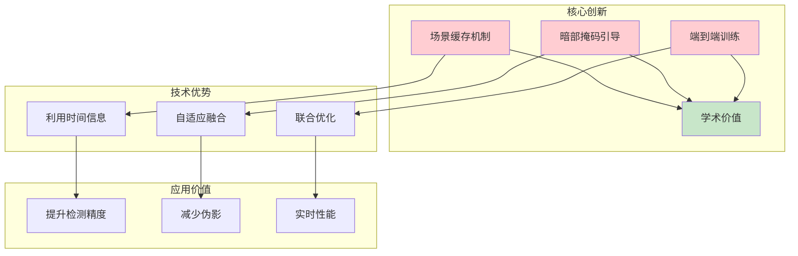
